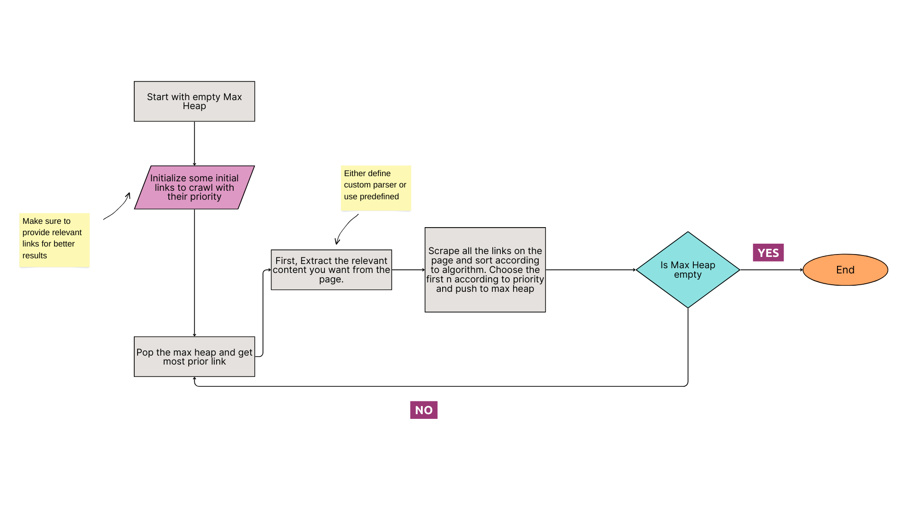

# Crawler Project

This project implements a customizable web crawler that scrapes and processes webpages using defined priority rules, keyword weights, and content type preferences. The crawler dynamically maintains a frontier of URLs and fetches content in a prioritized manner. Additionally, it provides an optional callback for parsing page content and saving output to a file or other destinations.

## Features

- **Link Prioritization**: Links are prioritized based on domain rules, keyword occurrences, and content type patterns in the URLs.
- **Customizable Parsing**: You can define a custom parsing function using a callback, or use the default HTML content extraction.
- **Dynamic Frontier Management**: The crawler keeps a dynamically managed frontier of links to crawl, allowing new links to be added on the go.
- **Progress Display**: A progress bar displays the current crawling status, including the URL being processed and the total number of links in the frontier.
- **Configurable Output**: Content scraped from each page can be written to a file or processed with an output callback.

## Workflow Overview



## Link Prioritization

The crawler uses the following rules to prioritize links:

1. **Domain-Based Rules**: Certain domains are given higher or lower priority based on predefined rules. For example, domains like `medium.com` might have higher priority.
2. **Keyword Weights**: The crawler scans the content of each page for specific keywords, assigning higher priority to pages that contain more frequent or important keywords.

3. **Content Type Weights**: URLs are also checked for specific content types (e.g., "article," "paper," "research"), giving preference to links that are more likely to match relevant content.

4. **Visited Domain Frequency**: The number of times a domain has been visited is tracked, and domains with fewer visits are given a higher initial priority to ensure diversity.

5. **URL Depth**: Links that are deeper in the site hierarchy (based on slashes `/`) are deprioritized to avoid overly specific or buried content.

## Installation

Clone this repository and install the necessary dependencies:

```bash
git clone https://github.com/yourusername/crawler-project.git
cd crawler-project
pip install -r requirements.txt
```

## Usage

The crawler can be run with an initial set of URLs, priority rules, and optional parsing/output callbacks. Here's an example:

```bash
from crawler import Crawler

crawl = Crawler(
    init_frontier=[(1, "https://medium.com/@eduminattttti/web-dev-task-97d9a899aa52")],
    priority_rules={
        "blog.medium.com": 10,
        "help.medium.com": 5,
        "policy.medium.com": 3,
        "medium.statuspage.io": 1,
        "speechify.com": 2,
    },
    keyword_weights={"medium": 5},
    content_type_weights={"article": 3, "tutorial": 3, "dataset": 5},
    priority_retention=3
)

crawl.start_crawl()
```

## Configuration

1. **priority_rules**: A dictionary mapping domains to priority values.

2. **keyword_weights**: A dictionary mapping keywords to their importance in calculating priority.

3. **content_type_weights**: A dictionary mapping URL content types to priority values.

4. **parse_callback**: An optional function that defines how to parse the content of the page.

5. **output_callback**: An optional function that handles output processing.

## Contributions

Feel free to submit issues or pull requests if you’d like to contribute or improve the crawler!